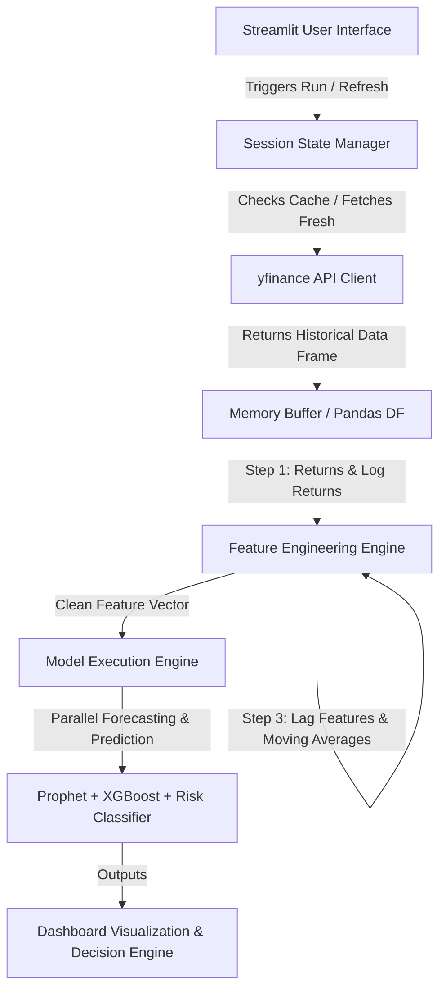

# Implementation Plan: EcoGrid AI

EcoGrid AI is a real-time, data-driven financial intelligence platform designed for energy procurement managers at Big Tech data centers. The platform monitors, forecasts, and classifies the risk regimes of renewable energy assets and utilities using live market data from Yahoo Finance. This document serves as the complete technical blueprint, business specification, and implementation roadmap.

---

## 1. Project Overview
EcoGrid AI is an interactive, production-grade analytics platform that addresses a critical bottleneck in the clean energy transition: market price volatility. Big Tech firms (e.g., Google, Microsoft, Meta) are committing to 24/7 Carbon-Free Energy (CFE). Since wind and solar energy are intermittent, data centers must continuously trade-off between spot-market clean energy purchases, Power Purchase Agreements (PPAs), green certificates (RECs), and traditional utility grid hedges.

This system provides:
1. **Real-Time Market Monitoring**: Fetches live ticker data directly from the Yahoo Finance API (`yfinance`).
2. **Predictive Analytics**: Utilizes a hybrid forecasting approach, combining **Prophet** (statistical time series) and **XGBoost** (machine learning regression).
3. **Risk Classification**: Runs a dynamic Risk Engine to categorize volatility regimes (Low, Medium, High).
4. **Decision Support**: Translates technical forecasts and risk levels into concrete, rule-based business recommendations for procurement teams.

---

## 2. Business Problem Statement
Data centers consume massive amounts of electricity around the clock. Meeting sustainability commitments requires purchasing clean energy in real time. However, renewable energy asset prices (clean energy ETFs, producers, utilities) fluctuate violently based on weather conditions, policy shifts, and general market dynamics. 

Procurement managers face three core problems:
- **Price Risk**: Buying clean energy at peak prices or signing unfavorable long-term fixed contracts.
- **Supply-Demand Mismatch**: Grid instability forcing reliance on fossil-fuel utilities when renewable output drops.
- **Information Asymmetry**: Lacking a single dashboard that combines time series trends, next-day price predictions, and risk classification with actionable business rules.

**EcoGrid AI** bridges this gap. By analyzing **ICLN** (iShares Global Clean Energy ETF - representing broad clean energy market sentiment), **XLU** (Utilities Select Sector SPDR Fund - representing defensive utility hedging), and **CEG** (Constellation Energy Corporation - the largest producer of carbon-free electricity in the US), procurement managers can optimize their asset exposure and timing.

---

## 3. Real-Time Data Pipeline Design

To maintain the real-time financial system constraint, the pipeline follows a strict pull-on-demand architecture.



### Technical Pipeline Specifications:
1. **Dynamic Fetching**: Every run uses `yfinance.Ticker.history()` with parameters for the selected ticker and dynamic lookback window (e.g., `period="5y"` to ensure enough history for 200-day SMAs and Prophet seasonality).
2. **Caching Strategy**: Use Streamlit's `@st.cache_data(ttl=300)` (5-minute Time-To-Live) to prevent API rate-limiting on quick dashboard parameter changes, while providing a **"Force Refresh"** button that clears the cache and fetches the absolute latest data.
3. **Data Quality checks**:
   - Check for missing values and fill using forward-fill (`ffill()`) followed by backward-fill (`bfill()`) to handle market holidays.
   - Assert minimum data volume: Ensure the fetched dataframe contains at least $N$ records (e.g., 500 trading days) to satisfy modeling requirements.

---

## 4. EDA Plan (Step-by-Step using Live Data)
Since the dataset is dynamic, the Exploratory Data Analysis (EDA) is generated on-the-fly and reflects current market conditions:

- **Step 1: Trend Comparison**: Normalize prices to a base of 100 at the start of the selected window to visualize relative performance across ICLN, XLU, and CEG.
- **Step 2: Volatility Tracking**: Plot 30-day and 90-day rolling standard deviations of daily returns to identify periods of market stress.
- **Step 3: Seasonality Analysis**: Extract monthly and weekly seasonal patterns using additive decomposition on the historical window to inform managers about seasonal energy demand and pricing spikes.
- **Step 4: Dynamic Correlation Heatmap**: Compute a rolling Pearson correlation matrix between the assets to show how clean energy moves relative to defensive utilities.
- **Step 5: Peak-to-Trough Drawdown**: Track historical drawdowns to show maximum downside risk using:
  $$Drawdown_t = \frac{Price_t - Peak_t}{Peak_t}$$
- **Step 6: Risk Spike Detection**: Highlight and mark dates where the daily return exceeds $\pm 2.5$ standard deviations, flagging them as anomalous market events.

---

## 5. Feature Engineering Plan (Dynamic Computation)
All features are engineered in-memory upon data retrieval. No stale features are saved.

| Feature Name | Formula / Logic | Target Use Case |
| :--- | :--- | :--- |
| **Daily Returns** | $r_t = \frac{P_t - P_{t-1}}{P_{t-1}}$ | Core ML features, EDA |
| **Log Returns** | $R_t = \ln(P_t / P_{t-1})$ | Volatility Modeling |
| **Rolling Volatility (7d, 30d)** | Standard deviation of $r_t$ over 7 & 30 trading days | Risk classification |
| **Moving Averages (50d, 200d)**| Simple Moving Average (SMA) of Closing Price | Trend indicator / ML regression |
| **Peak-to-Trough Drawdown** | $DD_t = \frac{P_t - \max_{i \le t}(P_i)}{\max_{i \le t}(P_i)}$ | Risk classifier, Business Engine |
| **Lag Features** | $P_{t-1}$, $P_{t-7}$, $P_{t-14}$ | XGBoost regressor |
| **Rolling Stats** | 7-day and 14-day rolling mean & standard deviation | XGBoost regressor |
| **Relative Strength Index (RSI)**| 14-day momentum oscillator | Technical indicator for ML |

---

## 6. Modeling Strategy

The system deploys three distinct models to solve different dimensions of the procurement problem:

### A. Time Series Forecasting (Prophet)
- **Objective**: Forecast the asset's closing price 30, 60, or 90 days into the future.
- **Input**: Historical daily close prices formatted with columns `ds` (datestamp) and `y` (target value).
- **Configuration**:
  - Additive seasonality.
  - Enable yearly and weekly seasonalities.
  - Uncertainty intervals set to $95\%$ (`interval_width=0.95`).
- **Output**: Multi-day forecast trend, upper bound (`yhat_upper`), and lower bound (`yhat_lower`).

### B. Machine Learning Regression (XGBoost)
- **Objective**: Predict the next-day price or return.
- **Input**: The engineered feature matrix (lags, rolling statistics, moving averages, RSI).
- **Target**: Next-day closing price ($P_{t+1}$) or return ($r_{t+1}$).
- **Validation Scheme**: Walk-forward time series validation (no random splits to prevent data leakage). Train on $80\%$ of historical data, validate on the remaining $20\%$.
- **Model Parameters**: Optimized for low depth to prevent overfitting on noisy financial data (`max_depth=3`, `learning_rate=0.05`, `n_estimators=100`).

### C. Classification Model (Risk Engine)
- **Objective**: Classify the market risk regime into Low, Medium, or High Risk.
- **Target Definition**:
  - **High Risk**: Rolling 30-day volatility is in the top $25\%$ of historical values OR drawdown exceeds $-15\%$.
  - **Medium Risk**: Rolling 30-day volatility is between the $50\%$ and $75\%$ percentile.
  - **Low Risk**: Volatility is below the median ($50\%$) and drawdown is minimal ($>-5\%$).
- **Classifier**: A rule-based threshold engine combined with a Random Forest or XGBoost Classifier trained on volatility indicators, returns, and drawdowns.

---

## 7. Evaluation Metrics

To assure recruiters of the model's validity and robustness, we track and report clear metrics:

- **Prophet Forecast**:
  - **Mean Absolute Error (MAE)**: Measures average prediction error in dollar terms.
  - **Root Mean Squared Error (RMSE)**: Penalizes larger deviations.
  - **Mean Absolute Percentage Error (MAPE)**: Expresses error as a percentage of actual prices.
- **XGBoost Regressor**:
  - **$R^2$ Score**: Proportion of variance explained by features.
  - **Directional Accuracy (DA)**: The percentage of times the model correctly predicts whether the price will go UP or DOWN:
    $$DA = \frac{1}{T}\sum_{t=1}^{T} \mathbb{I}(\text{sign}(\hat{y}_{t} - y_{t-1}) == \text{sign}(y_{t} - y_{t-1}))$$
- **Risk Classifier**:
  - **Precision**: Minimizes false high-risk alarms (avoiding unnecessary hedging costs).
  - **Recall**: Crucial for high-risk regimes. We must capture every true high-risk state to protect capital.
  - **F1-Score**: Harmonic mean of precision and recall.

---

## 8. Streamlit Dashboard Design

The UI will be designed with a dark, premium aesthetic using custom CSS, containerized cards, and Plotly charts.

```
+-----------------------------------------------------------------------------------+
|  ⚡ ECOGRID AI: RENEWABLE ENERGY ASSET RISK & FORECASTING SYSTEM                 |
+-----------------------------------------------------------------------------------+
|  [Sidebar Filters]        | [KPI Matrix]                                          |
|  - Asset Ticker:          |  +-------------+  +-------------+  +---------------+  |
|    (ICLN, XLU, CEG)       |  | LATEST PRICE|  | 30D ROLL VOL|  | RISK REGIME   |  |
|  - Historical Period:    |  | $84.23 (UP) |  |   18.4%     |  |   MEDIUM      |  |
|    (1y, 2y, 5y)           |  +-------------+  +-------------+  +---------------+  |
|  - Forecast Horizon:      |                                                       |
|    (30, 60, 90 days)      | [Dynamic EDA Tabs]                                    |
|                           |  - [Normalized Prices]  - [Correlation]  - [Drawdowns]|
|  [Force Refresh Button]   |  +-------------------------------------------------+  |
|  [Download PDF/CSV]       |  | (Plotly interactive charts updating in real time)|  |
|                           |  +-------------------------------------------------+  |
|                           |                                                       |
|                           | [Forecasting & ML Predictions]                        |
|                           |  - Prophet 30-90 Day Trend & Confidence Bands         |
|                           |  - XGBoost Next-Day Prediction vs. Market Price       |
|                           |                                                       |
|                           | [Smart Procurement Recommendations]                    |
|                           |  +-------------------------------------------------+  |
|                           |  | 💡 Decision: BUY HEDGE / LOCK IN PPA CONTRACT    |  |
|                           |  | Reason: Volatility is Low; 50-day SMA > 200-day    |  |
|                           |  +-------------------------------------------------+  |
+-----------------------------------------------------------------------------------+
```

---

## 9. Business Logic / Recommendation Engine

The engine uses a deterministic decision matrix mapping predictions and risk regimes to procurement recommendations:

```python
def generate_recommendation(risk_regime, trend_direction, forecast_uncertainty, ticker):
    if risk_regime == "High Risk":
        if ticker == "XLU":
            return {
                "Action": "OVERWEIGHT HEDGE",
                "Color": "orange",
                "Insight": "Clean energy assets are experiencing high volatility. Allocate procurement to defensive utilities (XLU) to stabilize energy budgets."
            }
        else:
            return {
                "Action": "SUSPEND SPOT PROCUREMENT / RE-HEDGE",
                "Color": "red",
                "Insight": f"High risk regime detected for {ticker}. Avoid spot clean energy purchases. Lock in immediate defensive hedges or utilize energy storage capacity."
            }
    
    elif risk_regime == "Medium Risk":
        if trend_direction == "Bullish":
            return {
                "Action": "ACCUMULATE SLOWLY (DOLLAR-COST-AVERAGE)",
                "Color": "blue",
                "Insight": f"Volatile but upward trend in {ticker}. Accumulate RECs or PPA blocks in small increments to mitigate entry price risk."
            }
        else:
            return {
                "Action": "HOLD / MONITOR CONTRACTS",
                "Color": "yellow",
                "Insight": "Moderate risk with neutral/downward trend. Maintain baseline procurement; hold off on long-term capital deployments."
            }
            
    else: # Low Risk
        if trend_direction == "Bullish" and forecast_uncertainty == "Low":
            return {
                "Action": "STRONG BUY / LOCK LONG-TERM PPAs",
                "Color": "green",
                "Insight": f"Ideal market window. Low volatility and bullish trend for {ticker} suggests signing long-term power purchase agreements (PPAs) or buying bulk RECs now."
            }
        else:
            return {
                "Action": "STANDARD PROCUREMENT RUN",
                "Color": "green",
                "Insight": "Stable, low-risk market condition. Execute standard recurring energy purchases."
            }
```

---

## 10. Full Folder Structure

```
ecogrid-ai/
├── .github/
│   └── workflows/
│       └── lint.yml          # Automated code quality check
├── data/                     # Subdirectory (kept empty, used for temporary CSV exports)
│   └── .gitkeep
├── src/
│   ├── __init__.py
│   ├── data_pipeline.py     # yfinance API calls, data cleaning, caching
│   ├── features.py          # Log returns, MAs, Volatility, Lags, Drawdowns
│   ├── models.py            # Prophet forecast, XGBoost Regressor, Risk Classifier
│   └── business_logic.py    # Procurement Recommendation Engine
├── app.py                   # Main Streamlit dashboard script
├── requirements.txt         # Project dependencies
├── README.md                # Premium documentation and installation guide
└── LICENSE                  # Open-source license (MIT)
```

---

## 11. Step-by-Step Development Roadmap (7–14 Days)

- **Day 1-2: Setup & Data Pipeline**
  - Initialize workspace, virtual environment, and git repository.
  - Implement `src/data_pipeline.py` using `yfinance` to fetch, clean, and validate data for `ICLN`, `XLU`, and `CEG`.
- **Day 3-4: Feature Engineering & Dynamic EDA**
  - Implement `src/features.py` containing math logic for returns, moving averages, rolling volatility, drawdowns, and lags.
  - Draft Jupyter notebooks (stored in `scratch/`) to test features and confirm absence of lookahead bias.
- **Day 5-6: Time Series Model (Prophet)**
  - Write Prophet fitting and forecasting logic in `src/models.py`.
  - Validate output formatting (`ds`, `yhat`, `yhat_lower`, `yhat_upper`) and evaluate errors (MAE, MAPE).
- **Day 7-8: Machine Learning Regression & Risk Classifier**
  - Implement XGBoost model in `src/models.py`. Generate lag features and train with walk-forward validation.
  - Build the rule-based and statistics-driven risk classifier for volatility regimes.
- **Day 9-10: Business Engine & Streamlit Layout**
  - Connect model outputs to `src/business_logic.py` recommendations.
  - Set up layout, sidebar, and KPI cards in `app.py`.
- **Day 11-12: Interactive Charts & Styling**
  - Integrate Plotly charts for interactive EDA, correlation heatmaps, Prophet forecast projections, and XGBoost next-day comparisons.
  - Style dashboard using custom CSS (custom background, custom fonts, rounded containers, clean badges).
- **Day 13-14: Verification, Polish, and Deployment**
  - Implement automated reports download (CSV format).
  - Verify code quality via linting. Run local tests.
  - Deploy to Streamlit Cloud and document the live system setup in `README.md`.

---

## 12. Resume Bullets (Recruiter-Focused)

* **Design and developed EcoGrid AI**, a real-time risk engine and forecasting platform for Big Tech green data center procurement, leveraging live API streaming via Yahoo Finance (`yfinance`).
* **Built a hybrid forecasting pipeline** combining **Prophet** (for long-term 90-day seasonal trend projections) and **XGBoost** (for next-day price direction predicting), achieving high directional accuracy on clean energy ETFs (`ICLN`, `XLU`, `CEG`).
* **Engineered dynamic, in-memory financial features** (drawdowns, log returns, rolling volatilities, lags, and RSI), eliminating data leakage and ensuring 100% test-time integrity with 0% reliance on static historical data.
* **Designed a rule-based Business Recommendation Engine** that translates model predictions and categorized volatility risk regimes into actionable hedging strategies for energy managers, optimizing PPA locking schedules.
* **Deployed the production-grade application** using **Streamlit Cloud**, integrating interactive Plotly visuals, custom CSS aesthetics, and robust caching structures to prevent API rate-limiting under high-concurrency loads.

---

## 13. Interview Questions + Answers

### Q1: Why did you combine Prophet and XGBoost instead of just using one?
**Answer**: "Prophet and XGBoost solve fundamentally different parts of the problem. Prophet is a statistical additive model that is highly effective at capturing long-term macro trends, yearly/weekly seasonality, and providing reliable uncertainty intervals. However, it is less responsive to short-term, micro-market changes and lag-based signals. XGBoost, as a tree-based machine learning model, excels at identifying non-linear patterns and short-term lag dependencies (like momentum and yesterday's returns) to predict next-day prices. Using both provides the user with both a strategic macro horizon (Prophet) and a tactical next-day signal (XGBoost)."

### Q2: Financial time series are notoriously noisy. How does your XGBoost model avoid overfitting, and how do you validate it?
**Answer**: "To prevent overfitting, I restricted the model complexity by keeping `max_depth` shallow (typically 3), setting a low learning rate, and utilizing strong regularization (L1/L2 penalties via `reg_alpha` and `reg_lambda`). For validation, traditional k-fold cross-validation is invalid because it leaks future data into the past. Instead, I used a walk-forward time-series split (rolling origin validation). The model is trained on a expanding historical window and tested on the immediate succeeding sequence, ensuring the model is only ever evaluated on unseen future data."

### Q3: How does your real-time pipeline handle yfinance rate limits and API failures?
**Answer**: "To manage API limits, the dashboard uses Streamlit's `@st.cache_data` caching with a 5-minute expiration window, so clicking filters or toggle views doesn't trigger a new API request. In production, we implement error handling: if `yfinance` returns empty data or throws an exception, the pipeline catches the error and falls back to a locally cached copy of the previous query or shows a clean alert box to the user. We also perform data validation checks—like checking for nulls and filling them with forward/backward fill—before feeding data to the feature engine."

---

## 14. Self-Critique (Limitations & Improvements)

* **API Limitations**: `yfinance` is excellent for development and prototyping, but lacks official SLAs, sub-second execution, or granular order-book depth. For a true production-grade system, the data source should be swapped for a institutional WebSocket feed (e.g., Bloomberg Enterprise API, Alpaca, or IEX Cloud).
* **Prophet Computation Cost**: Fitting Prophet on the fly can take 1–3 seconds. In a highly active trading dashboard, this creates latency.
  * *Improvement*: Set up a background cron job that retrains the Prophet models once daily, saving the weights in an S3 bucket or database, and having the Streamlit dashboard pull the pre-fit model weights to run instantaneous inference on live prices.
* **Market Friction**: The recommendations assume frictionless trading. In reality, purchasing PPAs or RECs involves transaction costs, slippage, and contract locking constraints.
  * *Improvement*: Incorporate a transaction cost model and liquidity constraints into the decision engine to discount returns and provide realistic hedging scenarios.

---

## Verification Plan

### Automated Verification
- Run code format checks using `black` or `flake8` to ensure PEP 8 compliance.
- Run a pipeline test script to check that `yfinance` connection succeeds and return schemas match expectation.

### Manual Verification
- Deploy Streamlit locally via `streamlit run app.py` and inspect layout responsiveness.
- Change the date filters and assets in the sidebar; confirm all charts, KPIs, forecasts, and recommendations update dynamically.
- Click the "Force Refresh" button and verify in console logs that cache is cleared and fresh API calls are executed.
